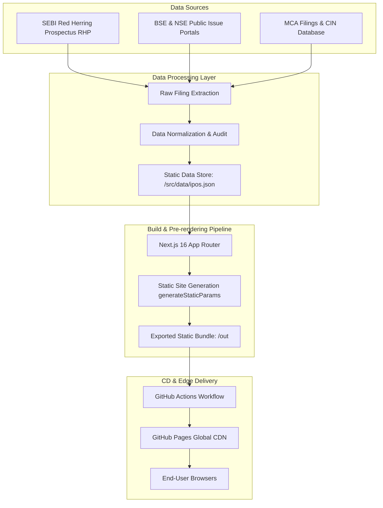
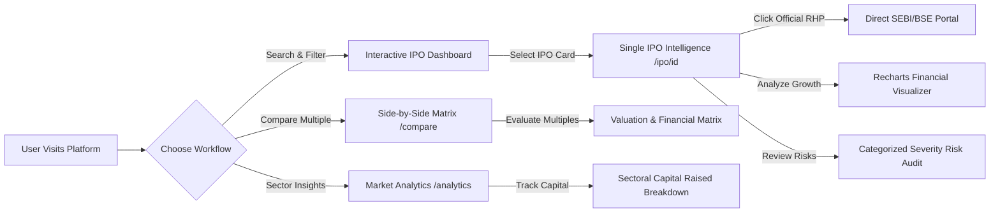
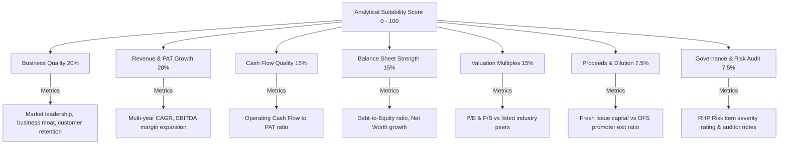

# 📈 IPO Insight India — Pure Static SEBI Data Intelligence Platform

[](https://github.com/Akash-Raj-Official/IPO-Insight/actions/workflows/deploy.yml)
[](https://nextjs.org/)
[](https://www.typescriptlang.org/)
[](https://tailwindcss.com/)
[](https://opensource.org/licenses/MIT)

> **A modern, high-performance, pure static data intelligence & analytics platform for Indian Mainboard & SME Initial Public Offerings (IPOs). Sourced directly from public regulatory filings to the Securities and Exchange Board of India (SEBI), BSE, and NSE.**

---

## 📑 Table of Contents
- [🌟 What Makes This Platform Special?](#-what-makes-this-platform-special)
- [🔄 Architecture & System Data Flow](#-architecture--system-data-flow)
  - [1. End-to-End Build & Deployment Flow](#1-end-to-end-build--deployment-flow)
  - [2. User Navigation & Feature Flow](#2-user-navigation--feature-flow)
  - [3. Suitability Scoring Engine Mechanics](#3-suitability-scoring-engine-mechanics)
- [📸 Graphical User Interface (GUI) Showcase](#-graphical-user-interface-gui-showcase)
  - [Interactive IPO Research Dashboard](#1-interactive-ipo-research-dashboard)
  - [Multi-Filter & Real-Time Search Controls](#2-multi-filter--real-time-search-controls)
  - [Deep-Dive Single IPO Intelligence Page](#3-deep-dive-single-ipo-intelligence-page)
  - [Recharts Financial Growth & Multi-Year Ratios](#4-recharts-financial-growth--multi-year-ratios)
  - [Side-by-Side IPO Comparison Matrix](#5-side-by-side-ipo-comparison-matrix)
  - [Market Analytics & Sector Insights](#6-market-analytics--sector-insights)
- [💻 Detailed Feature Breakdown](#-detailed-feature-breakdown)
- [🛠️ Technology Stack](#️-technology-stack)
- [📂 Directory Structure](#-directory-structure)
- [🚀 Getting Started & Local Setup](#-getting-started--local-setup)
- [⚙️ Automated CI/CD Pipeline](#️-automated-cicd-pipeline)
- [⚖️ Regulatory Disclaimer](#️-regulatory-disclaimer)

---

## 🌟 What Makes This Platform Special?

Traditional stock market applications rely on server-side rendering, expensive databases, and proxy APIs that slow down browsing and introduce downtime risks. **IPO Insight India** operates on a **Pure Static Web Architecture**:

- **⚡ Zero Latency Performance**: Every single page (including detailed dynamic single IPO analysis pages) is pre-rendered at build time into pure static HTML/JS using Next.js `output: 'export'` and `generateStaticParams()`.
- **🛡️ 100% Reliable Public SEBI Filings**: Financial metrics, risk factors, and subscription data are compiled directly from audited Red Herring Prospectuses (RHPs), BSE, and NSE releases.
- **🔗 Direct Links to Official Regulatory Portals**: Direct links to official `.gov.in` and exchange portals for immediate RHP verification with zero third-party file hosting.
- **📊 0-100 Analytical Suitability Scoring**: Evaluates IPOs across 7 quantitative financial pillars (Business Quality, Growth, Cash Flow, Balance Sheet, Valuation, Dilution Risk, and Governance).
- **💸 Zero Hosting Cost**: 100% automated CI/CD pipeline deploys static export artifacts directly to **GitHub Pages** for $0 server maintenance overhead.

---

## 🔄 Architecture & System Data Flow

### 1. End-to-End Build & Deployment Flow

The diagram below illustrates how raw regulatory data travels from official filings into pre-rendered static edge artifacts deployed on GitHub Pages:



---

### 2. User Navigation & Feature Flow

Users can explore the platform seamlessly across interactive dashboards, deep-dive single pages, comparative matrices, and sector analytics:



---

### 3. Suitability Scoring Engine Mechanics

The platform scores IPO issues from **0 to 100** based on a weighted 7-pillar quantitative scoring model:



---

## 📸 Graphical User Interface (GUI) Showcase

### 1. Interactive IPO Research Dashboard
The main landing page provides instant market summary statistics (Total Capital Raised, Average Listing Gain %, Top Listing Performer, Market Division) alongside status tabs (`All IPOs`, `Recently Listed`, `Open / Active`, `Upcoming`, `Closed`).


---

### 2. Multi-Filter & Real-Time Search Controls
Users can search by company name, sector, or registrar, filter by Mainboard vs SME, and sort by bidding date, issue size, listing gain, or suitability score. Toggling between Grid and Data Table display modes is fully supported.


---

### 3. Deep-Dive Single IPO Intelligence Page
Each IPO has its own pre-rendered analytical page featuring subscription progress timelines, price band details, lot sizes, lead manager breakdown, direct SEBI/BSE links, and the 0-100 analytical suitability score.


---

### 4. Recharts Financial Growth & Multi-Year Ratios
Interactive multi-year bar charts track Total Revenue, EBITDA, and Profit After Tax (PAT), accompanied by key balance sheet metrics (P/E ratio, P/B ratio, ROE %, ROCE %, and Debt-to-Equity).


---

### 5. Side-by-Side IPO Comparison Matrix
Allows investors to compare 2 to 4 IPOs side-by-side across valuation multiples, subscription demand, issue sizes, fresh issue vs OFS split, and suitability ratings.


---

### 6. Market Analytics & Sector Insights
Aggregated macro analytics highlighting capital raised by industry sector (Renewable Energy, Consumer Tech, Financial Services, Healthcare, etc.) and top listing-day gainers.


---

## 💻 Detailed Feature Breakdown

### 1. Interactive IPO Research Dashboard
- **Market Summary KPI Cards**: Real-time aggregated statistics covering total capital raised (₹ Cr), average listing gain %, top performer (+120%), and exchange split (Mainboard vs SME).
- **Status Filter Tabs**: Filter across `All IPOs`, `Recently Listed`, `Open / Active`, `Upcoming`, and `Closed` issues.
- **Search & Multi-Filter Controls**: Filter by search terms, industry sector, exchange type, and custom sorting (Issue Size, Bidding Date, Listing Return, Suitability Score).
- **Dual Display Layout**: Switch seamlessly between interactive visual cards and a dense tabular view.

### 2. Single IPO Deep-Dive Intelligence (`/ipo/[id]`)
- **Bidding Timeline**: Step-by-step progress tracking (Open Date, Close Date, Allotment Basis, Exchange Listing).
- **Direct Official Documents**: Quick links to official SEBI RHP, BSE Issue page, and NSE Live Quote.
- **Recharts Financial Growth Engine**: Visual multi-year trend charts for Revenue, EBITDA, PAT, and Net Worth.
- **Categorized Risk Factor Audit**: Clear risk badges categorizing risk factors into `HIGH`, `MODERATE`, and `LOW` severity levels.
- **Capital Allocation Breakdown**: Pie/Bar breakdown of Fresh Issue capital utilization (e.g., Debt repayment, expansion, corporate purposes) vs Offer for Sale (OFS).
- **Promoter Shareholding Track**: Pre-IPO vs Post-IPO equity percentage distribution.

### 3. Side-by-Side Comparison Tool (`/compare`)
- Select any 2 to 4 companies simultaneously.
- Compare valuation multiples (P/E, P/B), financial growth (Revenue, PAT), subscription multiples (Retail, QIB, NII), and issue structures.

### 4. Market Analytics & Macro Insights (`/analytics`)
- Visual distribution of capital raised across industries.
- Listing-day returns leaderboard and historic performance metrics.

---

## 🛠️ Technology Stack

| Layer | Technology | Purpose |
| :--- | :--- | :--- |
| **Framework** | [Next.js 16](https://nextjs.org/) (App Router) | Static export (`output: 'export'`) & SSG (`generateStaticParams`) |
| **Language** | [TypeScript 5](https://www.typescriptlang.org/) | Strict type-safety across IPO domain models & UI components |
| **Styling** | [Tailwind CSS v4](https://tailwindcss.com/) | Dark mode financial styling, glassmorphism, responsive grids |
| **Data Visualization** | [Recharts](https://recharts.org/) | Multi-year financial bar charts, revenue/PAT trend visualizers |
| **UI Icons** | [Lucide React](https://lucide.dev/) | Clean, modern iconography |
| **CI/CD Pipeline** | [GitHub Actions](https://github.com/features/actions) | Automated building, testing, and deployment pipeline |
| **Edge Hosting** | [GitHub Pages](https://pages.github.com/) | Free, fast global CDN hosting for pre-rendered static artifacts |
| **Data Layer** | Static JSON (`/src/data/ipos.json`) | Centralized, verified regulatory filing data repository |

---

## 📂 Directory Structure

```
frontend/
├── public/
│   ├── favicon.ico
│   └── images/               # Web assets & GUI screenshots
│       ├── dashboard_overview.png
│       ├── ipo_cards_filters.png
│       ├── ipo_detail_overview.png
│       ├── financial_charts_ratios.png
│       ├── ipo_comparison_matrix.png
│       └── market_analytics_sector.png
├── src/
│   ├── app/
│   │   ├── about/            # Data methodology & SEBI source guidelines
│   │   ├── analytics/        # Sector analysis & market insights page
│   │   ├── compare/          # Side-by-side IPO comparison matrix
│   │   ├── ipo/[id]/         # Dynamic SSG single IPO detail page
│   │   ├── upcoming/         # Filtered upcoming SEBI IPOs page
│   │   ├── globals.css       # Global design tokens & dark theme
│   │   ├── layout.tsx        # Global shell layout with Navbar & Footer
│   │   └── page.tsx          # Main interactive dashboard landing page
│   ├── components/
    │   ├── navbar.tsx        # Responsive navigation bar
    │   ├── footer.tsx        # Regulatory footer & SEBI disclaimers
    │   ├── financial-chart.tsx# Recharts multi-year visualizer
    │   └── ipo-card.tsx      # Interactive IPO grid card
│   ├── data/
│   │   └── ipos.json         # Master verified regulatory data store
│   └── types/
│       └── ipo.ts            # TypeScript interfaces & domain schemas
├── next.config.ts            # Static export configuration (`output: 'export'`)
├── package.json
├── tsconfig.json
└── README.md
```

---

## 🚀 Getting Started & Local Setup

### Prerequisites
- **Node.js**: `v20.0.0` or higher
- **npm**: `v10.0.0` or higher

### Installation Steps

1. **Clone the Repository**:
   ```bash
   git clone https://github.com/Akash-Raj-Official/IPO-Insight.git
   cd IPO-Insight/frontend
   ```

2. **Install Dependencies**:
   ```bash
   npm install
   ```

3. **Run Development Server**:
   ```bash
   npm run dev
   ```
   Open [http://localhost:3000](http://localhost:3000) in your browser to view the application.

4. **Build & Test Static Export**:
   ```bash
   npm run build
   ```
   This generates the pre-rendered static HTML bundle in the `./out` directory.

---

## ⚙️ Automated CI/CD Pipeline

The application features a fully automated deployment pipeline defined in `.github/workflows/deploy.yml`:

```yaml
name: Deploy Next.js site to Pages

on:
  push:
    branches: ["main"]

jobs:
  build-and-deploy:
    runs-on: ubuntu-latest
    steps:
      - name: Checkout Code
        uses: actions/checkout@v4

      - name: Setup Node.js
        uses: actions/setup-node@v4
        with:
          node-version: 20
          cache: 'npm'

      - name: Install Dependencies
        run: npm ci

      - name: Build Static Export
        run: npm run build

      - name: Deploy to GitHub Pages
        uses: peaceiris/actions-gh-pages@v3
        with:
          github_token: ${{ secrets.GITHUB_TOKEN }}
          publish_dir: ./out
```

---

## ⚖️ Regulatory Disclaimer

> **SEBI Regulatory Compliance Disclaimer**:  
> **IPO Insight India** is an open-source educational analytical project and is **NOT** registered with the Securities and Exchange Board of India (SEBI) as an Investment Advisor, Research Analyst, or Stockbroker.  
> All information displayed on this website is compiled strictly from publicly accessible regulatory filings (Red Herring Prospectuses - RHPs), exchange notices, and corporate disclosures. This site does not provide buy, sell, or investment advice. Investments in Initial Public Offerings involve market risk. Always read the complete official Red Herring Prospectus filed with SEBI before making investment decisions.

---

<p align="center">
  Crafted with ❤️ for Indian Stock Market Research. Sourced from official SEBI, BSE, and NSE filings.
</p>
