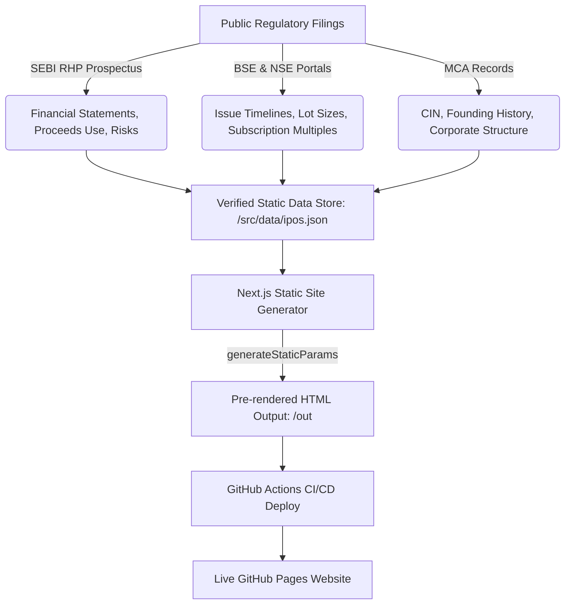

# 🚀 IPO Insight India — Pure Static SEBI Data Intelligence Platform

> **A modern, high-performance, pure static intelligence platform for Indian Mainboard & SME Initial Public Offerings (IPOs). Built with Next.js 16, TypeScript, Tailwind CSS, and Recharts, and auto-deployed to GitHub Pages via GitHub Actions.**

---

## 🌟 What Makes This Platform Special?

Unlike traditional financial web applications that require heavy backend servers, databases, and expensive proxy infrastructure, **IPO Insight India** operates on a **Pure Static Web Architecture**:

- **⚡ Zero Latency & Blazing Fast**: Every page (including detailed single IPO analysis pages) is pre-rendered into pure HTML/JS at build time using Next.js `output: 'export'` and `generateStaticParams()`.
- **🛡️ 100% Reliable Public Data**: Sourced directly from public filings made to the **Securities and Exchange Board of India (SEBI)**, **Bombay Stock Exchange (BSE)**, **National Stock Exchange (NSE)**, and **Ministry of Corporate Affairs (MCA)**.
- **🔗 Direct Links to Official Documents**: No file proxies or PDF uploads. Users access official Red Herring Prospectuses (RHPs) and exchange quotes via direct links to official `.gov.in` and exchange portals.
- **📊 0-100 Analytical Suitability Scoring**: Evaluates IPOs across 7 quantitative financial pillars (Business Quality, Revenue/PAT Growth, Cash Flow Ratio, Balance Sheet Strength, Valuation, Dilution Risk, and Governance).
- **💸 Zero Hosting Cost**: Fully automated CI/CD pipeline builds and deploys static export artifacts directly to **GitHub Pages** for $0 server overhead.

---

## 🔄 Data Flow & Verification Process

The verification flow guarantees that every metric displayed on the website traces back to an official public source:



### Where Details are Verified:
1. **Financial Statements & Ratios**: Sourced from restated/audited financial reports inside the **SEBI Red Herring Prospectus (RHP)**.
2. **Subscription Demand**: Multi-category oversubscription rates (Retail, NII/HNI, QIB) compiled from **BSE Public Issue releases** and **NSE IPO Center**.
3. **Risk Disclosures & Red Flags**: Categorized into `HIGH`, `MODERATE`, and `LOW` severity levels directly from Item 4 ("Risk Factors") of SEBI RHP filings.
4. **Promoter Shareholding**: Pre-IPO vs Post-IPO equity distribution and Offer for Sale (OFS) selling shareholder identification.

---

## 💻 Key Platform Features

### 1. Interactive IPO Research Dashboard
- **Hero Market Statistics**: Real-time summary of Total Capital Raised (₹ Cr), Average Listing Gain %, Top Listing Performer, and Market Breakdown (Mainboard vs SME).
- **Status Filter Tabs**: Switch seamlessly between `All IPOs`, `Recently Listed`, `Open / Active`, `Upcoming`, and `Closed` issues.
- **Advanced Multi-Filter Controls**: Instant search by company name or sector, exchange type filter, sector filter, and sorting (by issue size, listing return, or suitability score).
- **Dual Display Modes**: Toggle between interactive **Grid Cards** and a dense **Data Table**.

### 2. Deep-Dive Single IPO Intelligence (`/ipo/[id]`)
- **Visual Bidding Timeline**: Multi-step progress tracker covering Open Date, Close Date, Allotment Basis, and Exchange Listing.
- **Recharts Financial Growth Charts**: Interactive multi-year bar and area charts tracking Total Revenue, EBITDA, and Profit After Tax (PAT).
- **Key Ratios Grid**: Instant visibility into P/E Ratio, P/B Ratio, ROE %, and Debt-to-Equity.
- **Categorized Risk Factor Audit**: Clear risk badges identifying severity and impact explanations.
- **Promoter Shareholding & Use of Proceeds**: Pre vs Post IPO holding percentages and Fresh Issue capital allocation breakdown.
- **Post-Listing Performance Track**: Historic returns over 1D, 1W, 1M, 3M, 6M, and current return.

### 3. Side-by-Side IPO Comparison Matrix (`/compare`)
- Select 2 to 4 IPOs side-by-side to compare issue sizes, valuation multiples (P/E, P/B), financial profitability, subscription demand, and suitability scores.

### 4. Market Analytics & Sector Insights (`/analytics`)
- Visual sectoral breakdown of total capital raised and top listing day gainers leaderboard.

---

## 🛠️ Technology Stack

| Category | Technology |
| :--- | :--- |
| **Framework** | Next.js 16 (App Router, Static Export `output: 'export'`) |
| **Language** | TypeScript 5 |
| **Styling** | Tailwind CSS v4 + Base UI / Class Variance Authority |
| **Charts & Visuals** | Recharts (React 19 compatible) |
| **Icons** | Lucide React |
| **CI/CD & Hosting** | GitHub Actions → GitHub Pages |
| **Data Layer** | Static JSON (`/src/data/ipos.json`) |

---

## 🚀 Getting Started (Local Development)

### Prerequisites
- **Node.js**: v20.0.0 or higher
- **npm**: v10.0.0 or higher

### Installation

1. **Clone the Repository**:
   ```bash
   git clone https://github.com/Akash-Raj-Official/IPO-Insight.git
   cd IPO-Insight
   ```

2. **Install Dependencies**:
   ```bash
   npm install
   ```

3. **Start Development Server**:
   ```bash
   npm run dev
   ```
   Open [http://localhost:3000](http://localhost:3000) in your browser.

4. **Test Production Static Build**:
   ```bash
   npm run build
   ```
   Generates the pre-rendered static HTML site inside the `./out` directory.

---

## ⚙️ Automated GitHub Actions Deployment

The project includes a built-in CI/CD workflow (`.github/workflows/deploy.yml`). Whenever changes are pushed to the `main` branch, GitHub Actions automatically:
1. Checks out the code.
2. Sets up Node.js v20 and caches npm dependencies.
3. Runs `npm run build` to create static HTML pages.
4. Deploys the static `./out` bundle to **GitHub Pages**.

---

## ⚖️ SEBI Legal & Regulatory Disclaimer

> **Disclaimer**: IPO Insight India is an open-source educational analytical project and is **NOT** a SEBI-registered investment advisor, research analyst, or stockbroker. Information displayed on this site is compiled strictly from publicly available regulatory filings and exchange releases. Investments in Initial Public Offerings carry inherent market risks. Always read the complete Red Herring Prospectus (RHP) filed with SEBI before making investment decisions.

---

<p center>
  Crafted with ❤️ for Indian Stock Market Research. Sourced from SEBI, BSE, and NSE Public Filings.
</p>
